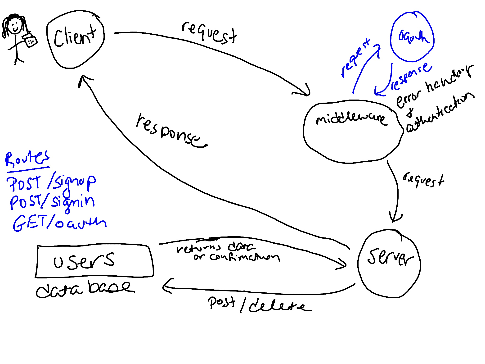

# authentication

This project contains an Authentication server.

### Author: Marlene Rinker

- [Submission PR](https://github.com/marlenerinker-401-advanced-javascript/auth-server/pull/4)
<!-- - [Tests Report](https://github.com/marlenerinker-401-advanced-javascript/api-server/actions) -->
<!-- - [Swagger Hub](https://app.swaggerhub.com/apis/marlene-rinker/api-server/0.1#/) -->
<!-- - [Heroku deployment](https://app-server-mr401.herokuapp.com/) -->

### Setup

#### `.env` requirements
PORT = <port> (will default to 3000 if you don't specify here)

MONGODB_ATLAS_URI=<route to mongo>

SECRET = <secret-string>

TOKEN_EXPIRATION = <when token should expire, for example: 1d>

#### Packages to Install
<!-- (see package.json)

dotenv
express
mongoose

For testing:
jest
cf-supergoose -->

#### Running the app
node index.js 
nodemon index.js

#### Tests
<!-- - Unit Tests: `npm test` (run from the `__tests__` folder to run all tests, multiple test files are in that folder) -->

- Assertions Made:

  - 

#### UML

#### Citations

